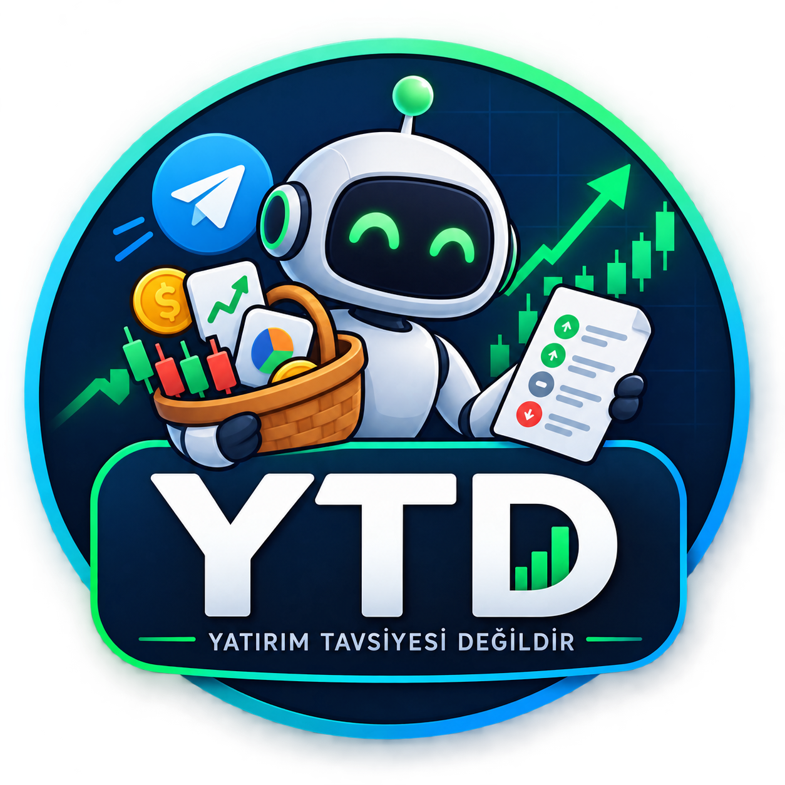

<div align="center">



# YTD Bot

**Haber okuyan, disiplinli sepet botu — orta-uzun vadeli yatırımcılar için.**

Bot her 4 saatte bir çalışır; sepete ancak katı kurallar sağlanınca dokunur.
Sık görüş değiştirmez. Gerçek para kullanmaz.

<br />

<div align="center">

[](LICENSE)
[](CHANGELOG.md)
[](https://www.python.org/downloads/)
[](https://core.telegram.org/bots)
[](https://www.anthropic.com/)
[](https://www.sqlite.org/)
[](https://github.com/ranaroussi/yfinance)

[](https://github.com/dcselek/ytd-bot/releases/latest)
[](https://github.com/dcselek/ytd-bot)
[](https://github.com/dcselek/ytd-bot/issues)
[](https://github.com/dcselek/ytd-bot/commits)

</div>

<br />

[**Kurulum**](#kurulum) ·
[**Hızlı başlangıç**](#hızlı-başlangıç) ·
[**Nasıl çalışır**](#nasıl-çalışır) ·
[**Disiplin**](#disiplin-kuralları) ·
[**Komutlar**](#telegram-komutları) ·
[**Yapı**](#proje-yapısı)

</div>

---

> **⚠️ Yatırım tavsiyesi değildir.** Bu proje eğitim ve deneysel amaçlıdır.
> Temsilî portföy gerçek para ile işlem yapmaz. Yatırım kararlarınızı kendiniz verin.

---

## Neden YTD Bot?

- **Disiplin önce.** 4 saatte bir analiz eder; sepeti her döngüde değiştirmez.
  Minimum sepet ömrü, görüş onayı ve güven eşiği olmadan işlem yok.
- **Haber + piyasa.** 9 RSS kaynağından haber toplar, 24 enstrümanın TL bazlı
  fiyat/momentum verisini kullanır.
- **LLM opsiyonel.** `ANTHROPIC_API_KEY` varsa Anthropic ile rejim analizi;
  yoksa anahtar kelime tabanlı yedek ile çalışmaya devam eder.
- **3 risk profili.** Düşük / orta / yüksek — her biri 100.000 TL temsilî
  sermaye ile başlar; komisyon dahil simüle edilir.
- **Karışık sepet.** Hisse, endeks, altın; uygunsa yerli (TEFAS) veya yabancı fon/ETF.
- **Pasif gelir tercihi (`/tercih`).** Temettü/borçlanma ağırlıklı veya büyüme odaklı.
- **Senin bakiyen (`/bakiye`).** Bot sepetindeki tutarlar bakiyene göre ölçeklenir.
- **Senin sepetin (`/sepetim`).** Kendi ticker listeni ekle (BIST, ABD, Avrupa,
  Japonya, TEFAS); TL fiyat + ilgili haber + botla karşılaştırma.
- **Şeffaf gerekçe.** Her değişim nedeniyle kaydedilir; `/gecmis` ile izlenir.
- **Telegram-native.** Sepet, portföy, performans ve bildirimler sohbet içinde.

---

## Nasıl çalışır

```
Her CYCLE_HOURS saatte bir (varsayılan: 4):

  1. 9 RSS kaynağından haber topla
     → önem sırası: T1 kritik / T2 önemli / T3 genel

  2. 24 enstrümanın TL bazlı fiyat + momentum verisini çek (yfinance)

  3. Piyasa görüşü üret
     → bullish | balanced | bearish + güven skoru (1–10)
     → kaynak: LLM (Anthropic) veya kural tabanlı yedek

  4. Disiplin motorundan geçir
     → "sepet değişebilir mi?" → hold | rebalance | switch

  5. Değişebiliyorsa
     → sepeti güncelle, temsilî portföyü taşı, kullanıcıya gerekçeyle bildir
```

```
┌─────────────┐   ┌─────────────┐   ┌──────────────┐
│  RSS news   │   │  yfinance   │   │  Anthropic   │
│  (9 feeds)  │   │  (quotes)   │   │  (optional)  │
└──────┬──────┘   └──────┬──────┘   └──────┬───────┘
       │                 │                 │
       └────────────┬────┴─────────────────┘
                    ▼
            ┌───────────────┐
            │   analysis    │  regime + confidence
            └───────┬───────┘
                    ▼
            ┌───────────────┐
            │  discipline   │  hold / rebalance / switch
            └───────┬───────┘
                    ▼
            ┌───────────────┐     ┌──────────────┐
            │   baskets +   │────▶│   Telegram   │
            │   portfolio   │     │   commands   │
            └───────────────┘     └──────────────┘
                    │
                    ▼
                 SQLite
```

---

## Disiplin kuralları

Botun karakteri burada. Kurallar `ytdbot/discipline.py` içinde ve `.env`
üzerinden ayarlanır:

| Kural | Varsayılan | Amaç |
|---|---|---|
| Minimum sepet ömrü | 14 gün | Sepet kurulduktan sonra en az bu süre korunur |
| Görüş onayı | 3 ardışık döngü | Tek seferlik sinyalle işlem yapılmaz |
| Güven eşiği | 6/10 | Altındaki sinyaller gürültü sayılır |
| Acil istisna | Kritik haber + güven 8/10 | Temel gelişmelerde süre kuralı aşılabilir |
| Kademeli geçiş | 2 adım, 3 gün ara | Yeni sepete tek hamlede geçilmez |
| Ağırlık ayarı | %5 sapma, 7 günde bir | Küçük sapmalar için komisyon ödenmez |

---

## Kurulum

### Gereksinimler

- Python **3.11+**
- Telegram bot token ([@BotFather](https://t.me/BotFather))
- (Opsiyonel) Anthropic API anahtarı

### Windows (PowerShell)

```powershell
git clone https://github.com/dcselek/ytd-bot.git
cd ytd-bot

py -3.11 -m venv .venv
.\.venv\Scripts\python.exe -m pip install -r requirements.txt
Copy-Item .env.example .env
```

### Linux / macOS

```bash
git clone https://github.com/dcselek/ytd-bot.git
cd ytd-bot

python3.11 -m venv .venv
.venv/bin/python -m pip install -r requirements.txt
cp .env.example .env
```

### `.env` ayarları

| Değişken | Zorunlu | Açıklama |
|---|---|---|
| `TELEGRAM_BOT_TOKEN` | Evet | BotFather token |
| `ADMIN_CHAT_IDS` | Hayır | `/calistir` için admin chat id'leri (virgülle). Boşsa herkese açık |
| `ANTHROPIC_API_KEY` | Hayır | Boş bırakılırsa kural tabanlı yedek kullanılır |
| `ANTHROPIC_MODEL` | Hayır | Varsayılan: `claude-sonnet-4-5` |
| `CYCLE_HOURS` | Hayır | Analiz döngüsü (saat), varsayılan `4` |
| `START_CAPITAL_TRY` | Hayır | Temsilî başlangıç sermayesi, varsayılan `100000` |
| `BROKER_FEE_BPS` | Hayır | Komisyon (bps), varsayılan `15` (= %0,15) |
| `MONEY_MARKET_ANNUAL_RATE` | Hayır | Likit fon yıllık getiri varsayımı (%) |
| `MIN_BASKET_LIFETIME_DAYS` | Hayır | Minimum sepet ömrü |
| `REGIME_CONFIRMATION_CYCLES` | Hayır | Görüş onay döngüsü sayısı |
| `MIN_SWITCH_CONFIDENCE` | Hayır | Değişim için minimum güven |
| `EMERGENCY_SWITCH_CONFIDENCE` | Hayır | Acil istisna eşiği |
| `NEWS_LOOKBACK_HOURS` | Hayır | Haber bakış penceresi |
| `MAX_NEWS_ITEMS` | Hayır | Döngü başına max haber |
| `MAX_WATCHLIST_ITEMS` | Hayır | `/sepetim` max sembol, varsayılan `15` |
| `DB_PATH` | Hayır | SQLite yolu |

Tam şablon: [`.env.example`](.env.example)

---

## Hızlı başlangıç

```powershell
# 1) .env doldur (en az TELEGRAM_BOT_TOKEN)
# 2) botu başlat
.\.venv\Scripts\python.exe run_bot.py
```

Telegram'da botunuza `/start` yazın ve risk profilinizi seçin.
İlk analiz döngüsü başlatmadan kısa süre sonra çalışır.

Telegram olmadan tek döngü test:

```powershell
.\.venv\Scripts\python.exe run_cycle.py
.\.venv\Scripts\python.exe run_cycle.py --messages
```

---

## Telegram komutları

| Komut | Ne yapar |
|---|---|
| `/start` | Karşılama + risk profili seçimi |
| `/sepet` | Botun temsilî sepeti (hisse / fon-ETF + tutar) |
| `/tercih` | Pasif gelir / büyüme tercihi |
| `/bakiye` | Bot sepeti için senin bakiyen (TL) |
| `/sepetim` | Senin takip sepetin (TEFAS / Yahoo, haber, vs, uyarı) |
| `/portfoy` | Temsilî kâr/zarar + referanslar |
| `/performans` | Profillerin yan yana karşılaştırması |
| `/durum` | Piyasa görüşü, son karar, değişim olasılığı |
| `/analiz` | Gerekçeler, riskler, sektör görüşleri |
| `/gecmis` | Sepet değişim geçmişi ve nedenleri |
| `/profil` | Risk profilini değiştir |
| `/bildirim` | Bildirimleri aç/kapat |
| `/surum` | Bot sürümü |
| `/calistir` | Analiz döngüsünü elle tetikle (`ADMIN_CHAT_IDS` ile kısıtlanabilir) |

### `/sepetim` alt komutları

```text
/sepetim                         → liste + TL fiyat / momentum
/sepetim ekle AAPL 30            → hisse/ETF (Yahoo)
/sepetim ekle MAC tefas 20       → TEFAS yatırım fonu
/sepetim ekle MAC yahoo          → aynı kodun ABD (NYSE/PCX) karşılığı
/sepetim sil TEFAS:MAC           → çıkar
/sepetim haber                   → sepetinle ilgili RSS haberleri
/sepetim analiz                  → sepetine özel değerlendirme (LLM/kural)
/sepetim butce 100000            → sepet bütçesi (TL); ağırlığa göre tahmini tutar
/sepetim butce kapat             → bütçeyi temizle
/sepetim vs                      → bot sepetiyle ~20g karşılaştırma
/sepetim uyari 3                 → 1g ±%3 hareket uyarısı (günlük özette)
/sepetim uyari kapat             → uyarıyı kapat
/sepetim temizle                 → tümünü sil
/sepetim yardim                  → yardım
```

**`/analiz` vs `/sepetim analiz`:** `/analiz` botun genel piyasa görüşüdür;
`/sepetim analiz` yalnızca senin takip listen + ilgili haberler üzerinedir.

**Bütçe:** `/sepetim butce 100000` sonrası ağırlıklı sembollerde tahmini TL tutarı
ve yaklaşık adet gösterilir. Kağıt üstü takip — gerçek işlem yapılmaz.**TEFAS vs Yahoo/PCX:** Kısa fon kodları (`MAC`, `TTE`…) Yahoo’da ABD hissesiyle
çakışabilir. Bot otomatik önce [TEFAS](https://www.tefas.gov.tr/)’a bakar.
Zorlamak için `tefas` veya `yahoo` yazın.

Örnek çoklu borsa: `AAPL`, `QQQ`, `THYAO.IS`, `VWCE.DE`, `7203.T`, `TEFAS:MAC`

---

## Geliştirme araçları

```powershell
# Disiplin kurallarını zamanı ileri sararak test et (ağ gerekmez)
.\.venv\Scripts\python.exe scripts\simulate_discipline.py

# Veri kaynaklarının canlı olup olmadığını kontrol et
.\.venv\Scripts\python.exe scripts\check_sources.py
```

---

## Proje yapısı

```
ytd-bot/
├── run_bot.py              # Telegram botu + zamanlayıcı
├── run_cycle.py            # Tek seferlik analiz döngüsü (CLI)
├── requirements.txt
├── .env.example
├── LICENSE                 # MIT
├── scripts/
│   ├── simulate_discipline.py
│   └── check_sources.py
└── ytdbot/
    ├── config.py           # Ortam değişkenleri
    ├── universe.py         # 24 enstrüman (+ 2 sentetik)
    ├── market.py           # yfinance, TL bazına çevirme, önbellek
    ├── news.py             # RSS toplama, tier sınıflandırması
    ├── analysis.py         # LLM analizi + kural tabanlı yedek
    ├── baskets.py          # Risk profili × görüş → ağırlıklar
    ├── discipline.py       # "Değişebilir mi?" karar motoru
    ├── funds.py            # Opsiyonel TEFAS + yabancı fon/ETF katalogu
    ├── watchlist.py        # Kullanıcı takip sepeti (/sepetim)
    ├── tefas.py            # TEFAS fon fiyatları (tefasmak)
    ├── portfolio.py        # Temsilî alım/satım, PnL, referanslar
    ├── formatting.py       # Telegram mesaj şablonları
    ├── engine.py           # Döngü orkestrasyonu
    ├── bot.py              # Komutlar + job queue
    └── storage.py          # SQLite kalıcı depolama
```

---

## Sınırlar

- Fiyat verisi Yahoo Finance üzerinden gelir; gecikmeli olabilir.
- BIST endeksleri ETF yerine endeks olarak modellenir.
- Likit fon getirisi gerçek fon NAV'ı değil; `MONEY_MARKET_ANNUAL_RATE` ile sentetiktir.
- Kural tabanlı yedek analiz haber içeriğini yorumlamaz; anahtar kelime tarar.
- Bu proje yatırım tavsiyesi üretmez.

---

## Katkı

Issue ve PR'lar memnuniyetle karşılanır. Büyük değişiklikler için önce issue açın.

1. Fork edin
2. Feature branch açın (`git checkout -b feature/xyz`)
3. Değişiklikleri commit edin
4. PR gönderin

---

## Lisans

[MIT](LICENSE) — özgürce kullanın, değiştirin, paylaşın.
Katkılar da aynı lisans altında kabul edilir.

## Sürüm

Güncel sürüm: **0.4.0** — ayrıntılar [CHANGELOG.md](CHANGELOG.md).
